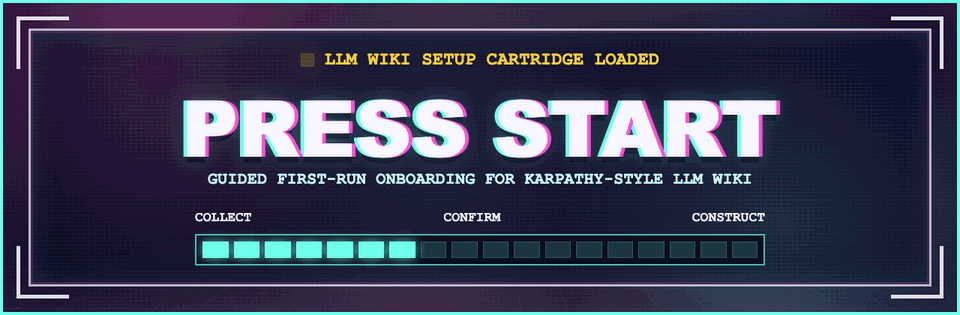

# Press Start

Guided first-run onboarding for [Andrej Karpathy's LLM Wiki](https://gist.github.com/karpathy/442a6bf555914893e9891c11519de94f), made for complete beginners.

Press Start does not replace or redesign LLM Wiki. It helps people move from ChatGPT or Claude in a web browser to a file-working agent like Codex or Claude Code, install the proven Karpathy-style setup, collect useful context from the AI tools and documents they already use, confirm what is accurate, answer targeted follow-up questions, and bootstrap the first useful wiki pages.

No AI background is assumed.

Press Start is meant to be run once. After the wiki is set up, the assistant should offer to remove or disable Press Start so future sessions use the LLM Wiki directly.

## What It Does

- Points users to the canonical LLM Wiki source first.
- Explains the difference between web chat and a file-working agent in plain language.
- Walks beginners toward Codex or Claude Code one step at a time.
- Verifies or creates the standard `raw/` and `wiki/` structure.
- Gives copy-paste prompts for ChatGPT, Claude, Gemini, Perplexity, and coding agents.
- Helps users paste messy context back into the setup chat.
- Finds missing, stale, sensitive, or contradictory information.
- Asks targeted follow-up questions instead of a generic form.
- Creates the initial wiki pages, index, and bootstrap log entry.
- Offers to remove or disable itself after setup is complete.

## Skill Files

```text
press-start/
  SKILL.md
  README.md
  agents/openai.yaml
  references/interview-map.md
  references/context-export-prompts.md
  assets/readme-banner/
```

## If You Are Brand New

You do not need to understand AI, coding, GitHub, or the command line.

The basic idea is simple:

- ChatGPT and Claude in a browser mostly talk with you.
- Codex and Claude Code can also work with files on your computer.
- LLM Wiki is a folder of text files that gives those assistants memory.
- Press Start walks you through setting that up.

If someone sent you this repo, ask them to help you open Codex or Claude Code first. Then paste this:

```text
Use Press Start to help me set up a Karpathy-style LLM Wiki. I am a complete beginner, so explain everything one step at a time and do not assume I know AI, coding, Terminal, GitHub, markdown, folders, or files.
```

## If You Are Helping Someone

Install or copy the skill into their agent environment, then start with:

```text
Use $press-start to install a Karpathy-style LLM Wiki and guide me through first-run context intake.
```

The skill will start by sending you to the canonical LLM Wiki:

https://gist.github.com/karpathy/442a6bf555914893e9891c11519de94f

Then it will walk you through the beginner setup process step by step.

Useful official setup links:

- Codex: https://developers.openai.com/codex/explore
- Claude Code: https://docs.anthropic.com/en/docs/claude-code/getting-started

## Positioning

Karpathy's LLM Wiki is the backbone.

Press Start is the setup guide: collect, confirm, construct.
